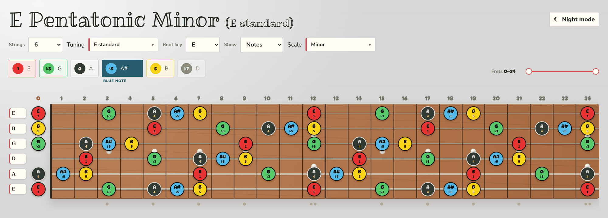
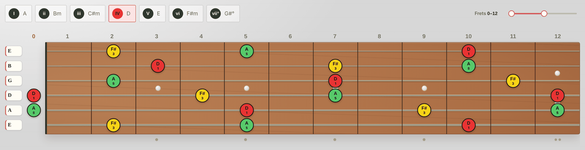
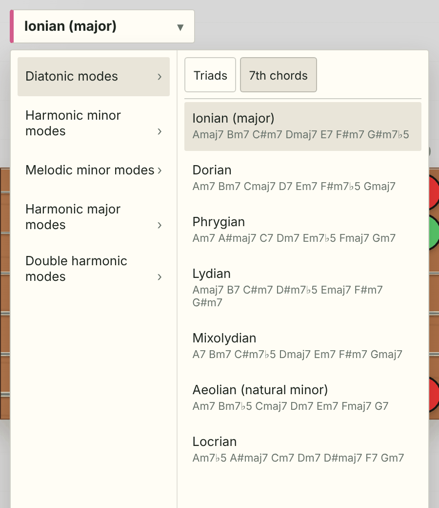
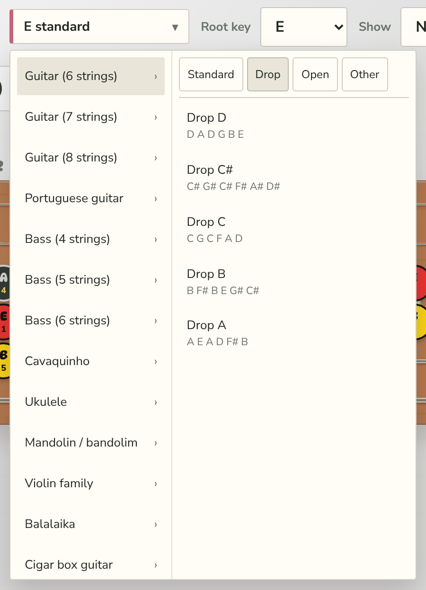
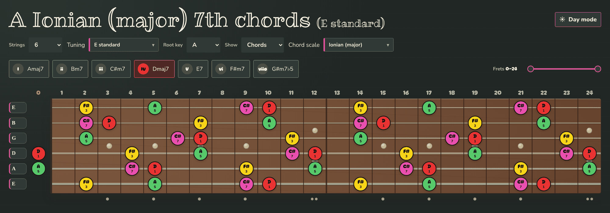
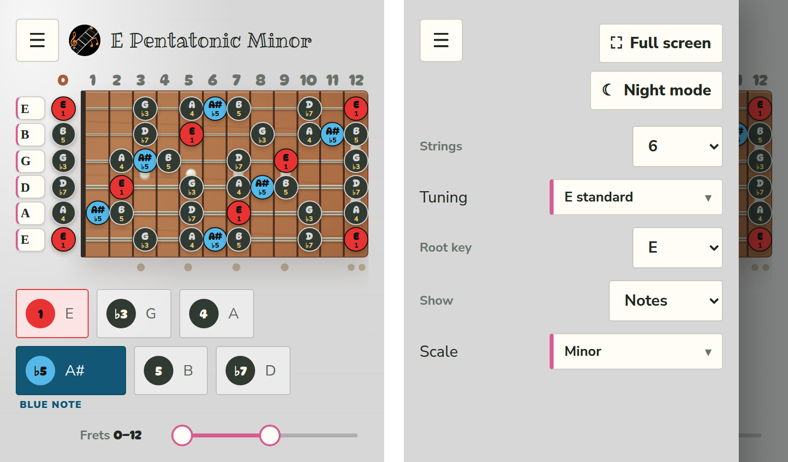

# 🎸 Scaleminator

**An interactive fretboard for guitar, bass, cavaquinho and other string instruments.**
Pick a root, a scale and a tuning, and see every note on the neck. Or switch to chords and walk through the harmony of a scale one chord at a time.

> 📄 One HTML file. No build step, no install, no dependencies. Open `scaleminatorWithFonts.html` and play, even offline.

---

## ✨ Features at a glance

| | |
|---|---|
| 🎼 **97 scales** | Every one has its own set of intervals, with no duplicates under different names |
| 🎹 **Chord mode** | Triads and 7th chords for 35 chord scales |
| 🪕 **13 instruments** | 3 to 8 strings, with tunings for each one |
| 🎨 **Colour-coded notes** | Focus, show or hide each note |
| 📏 **Fret range** | Show the whole neck or just a few frets |
| 🌙 **Night mode** | Easy on the eyes on stage or late at night |
| 📱 **Responsive** | Works on desktop, tablet and phone |
| ✈️ **Works offline** | The fonts are built into the page |

---

## 🎛️ The controls

1. **Strings:** 3 to 8. The neck redraws itself to match.
2. **Tuning:** grouped by instrument. Each string's letter on the left of the neck is also a dropdown, so you can make a custom tuning.
3. **Root key:** any key from A to G#.
4. **Show:** switch between **Notes** (scale notes) and **Chords** (the chords of a scale).
5. **Scale / Chord scale:** a menu grouped into families.

---

## 🎼 Notes mode

Each note of the scale is a button. **Click a note to cycle it through three states:**

- 🔴 **Focused:** highlighted in colour. The root is always **red**. The other notes take colours in the order you focus them: 🟡 yellow → 🟢 green → 🩷 pink → 🟠 orange → 🟣 purple → ⚪ grey → 🟤 brown.
- ⚫ **Showing:** a plain dark note.
- 🫥 **Hidden:** the note is removed from the neck.

🔵 **Blue notes:** the optional ♭5 (minor pentatonic) and ♭3 (major pentatonic) can be switched on, and they show in blue.

Each note on the neck shows its **name** and its **scale degree** (1, ♭3, 5…).

<b>📚 All scale families</b>

- Pentatonic (Common, Japanese, Indian, Other)
- Blues & bebop
- Diatonic modes · Harmonic minor modes · Melodic minor modes
- Harmonic major modes · Double harmonic modes
- Hexatonic · Symmetric · Synthetic & Messiaen
- European & Mediterranean · Indian & Middle Eastern

---

## 🎹 Chords mode

Set **Show → Chords** and the buttons become the **chords of the scale**, labelled with Roman numerals (I, ii, iii, IV…).

- 👆 **One chord at a time:** click a chord to show it. The active button turns red.
- 🎯 **Only the chord tones** appear on the neck: the chord's root in 🔴 red, the 3rd in 🟡 yellow, the 5th in 🟢 green and the 7th in 🩷 pink.
- 🔢 Each note is labelled with its **interval in the chord** (1, ♭3, 5, ♭7).

The **Chord scale** menu has a **Triads / 7th chords** toggle. Under each mode you can see the chords it gives in your key before you pick it.

Chord scale families: diatonic modes, harmonic minor, melodic minor, harmonic major and double harmonic.

<table>
<tr>
<td width="50%"></td>
<td width="50%"></td>
</tr>
<tr>
<td align="center">🎹 Chord scale menu, with chord previews</td>
<td align="center">🎸 Tuning menu, grouped by instrument</td>
</tr>
</table>

---

## 🪕 Instruments & tunings

| Instrument | Frets | Tunings |
|---|:---:|---|
| 🎸 Guitar (6 strings) | 24 | **Standard:** E, Eb, D, C#, C, B, A · **Drop:** D, C#, C, B, A · **Open:** G, D, E, C, A · **Other:** DADGAD, double drop D, all fourths, new standard |
| 🎸 Guitar (7 / 8 strings) | 24 | B standard, Drop A, A standard, Russian · F# standard, Drop E, F standard |
| 🇵🇹 Portuguese guitar | 22 | Lisboa, Coimbra |
| 🎸 Bass (4 / 5 / 6 strings) | 24 | E standard, Drop D, D standard, BEAD, high C… |
| 🪕 Cavaquinho | 17 | Natural, Coimbra, Sol-Sol-Si-Ré, Maia / Barcelos, Lá-Lá-Dó#-Mi |
| 🌺 Ukulele | 18 | Standard (GCEA), D tuning, Baritone |
| 🎻 Mandolin · Violin family | 20 · 24 | GDAE, Mandola / Viola / Cello (CGDA) |
| 🔺 Balalaika · 📦 Cigar box | 19 · 20 | Prima (EEA) · Open G, Open D |

✏️ **Custom tunings:** change any string's open note. If the result matches a known tuning, it takes that tuning's name.

---

## 🌙 Night mode

---

## 📱 On your phone

On smaller screens, a compact layout shows up to 12 frets at a time, with no sideways scrolling. The controls move into a side drawer (☰).

---

## 🚀 Usage

1. Clone or download this repository.
2. Open one of the two pages in any modern browser. That's it. 🎉

| File | Fonts | Size | Use it when… |
|---|---|:---:|---|
| ✈️ `scaleminatorWithFonts.html` | Built into the page | ~300 KB | You want it to look right anywhere, **even offline**. Recommended. |
| 🌐 `scaleminator.html` | Loaded from Google Fonts | ~90 KB | You're online and want the lightest file, or you want to edit the code. Offline, it falls back to system fonts. |

Both pages work the same way. The only difference is where the fonts come from.

## 📲 Try it online

Open [Scaleminator on GitHub Pages](https://tiagocardoso91.github.io/Scaleminator/scaleminator.html), or scan the code with your phone:

## 🛠️ Built with

Plain **HTML**, **CSS** and **JavaScript**. No frameworks.

🔤 Fonts: [DynaPuff](https://fonts.google.com/specimen/DynaPuff), [Nunito Sans](https://fonts.google.com/specimen/Nunito+Sans) and [Ribeye Marrow](https://fonts.google.com/specimen/Ribeye+Marrow), all under the SIL Open Font License 1.1 (see [`FONT-LICENSES.txt`](FONT-LICENSES.txt)).
